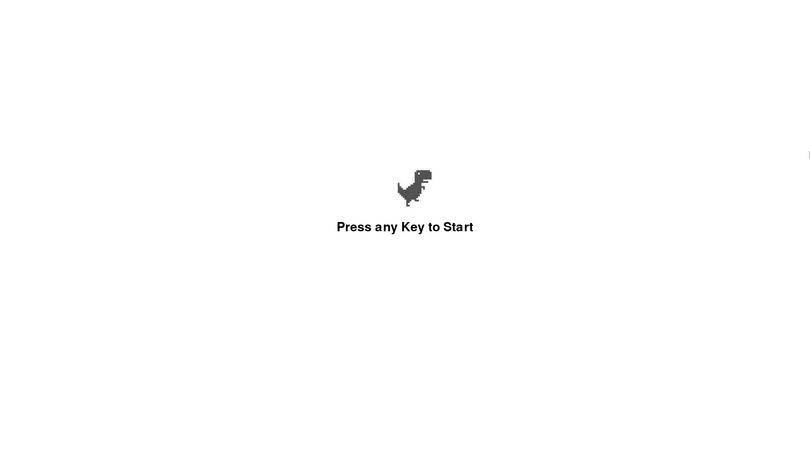

# Chrome Dino Game
## CS110 Final Project  Spring, 2024

## Team Members

Tiffany Lin

***

## Project Description

Chrome dinosaur game. Press any key to start. Avoid the obstacles: use the up arrow or spacebar to jump, use the down arrow to duck. Game is over when the dinosaur touches the cactus or bird.

***    

## GUI Design

### Initial Design

### Final Design

## Program Design

### Features

1. Start menu
2. Movable character
3. Obstacle collision
4. Scrolling background
5. Game over screen

### Classes
#### Dinosaur
- initializes and renders the dinosaur
- handles the actions of the dinosaur such as ducking, running, and jumping
#### Cloud
- initializes the clouds
- the cloud is placed according to the x and y coordinates set
#### Obstacles
- initializes the obstacles
- if it is off the screen, the obstacle is removed
#### Small Cactus
- initializes a random image of the small cactus placed at a fixed height
#### Large Cactus
- initializes a random image of the large cactus placed at a fixed height
#### Bird
- initializes the birds placed at a fixed height

## ATP

### Test Case 1: Jump
1. Start game.
2. Press space or up arrow.
3. Verify that the dinosaur jumps.

**Expected outcome**: The dinosaur should jump when the spacebar or up arrow is pressed.

### Test Case 2: Duck
1. Start game.
2. Press down arrow to duck.
3. Verify that the dinosaur ducks.

**Expected outcome**: The dinosaur should duck when the down arrow is pressed.

### Test Case 3: Game Over
1. Start game.
2. Play until the dinosaur hits an obstacle.
3. Verify that the game will display a "Game Over" message.

**Expected outcome**: The game should display a "Game Over" message when the dinosaur hits an obstacle.

### Test Case 4: Unused Keystrokes
1. Start game.
2. Enter unused keystrokes during gameplay.
3. Verify that the game will not crash.

**Expected outcome**: The game will not crash and would ignore the inputs.

### Test Case 5: Save Score
1. Start game.
2. Play until the dinosaur hits an obstacle.
3. Verify that the game saves the score to `results.txt`.

**Expected outcome**: The game will save the score to `results.txt`.